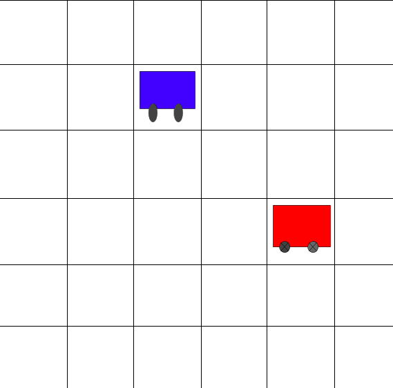
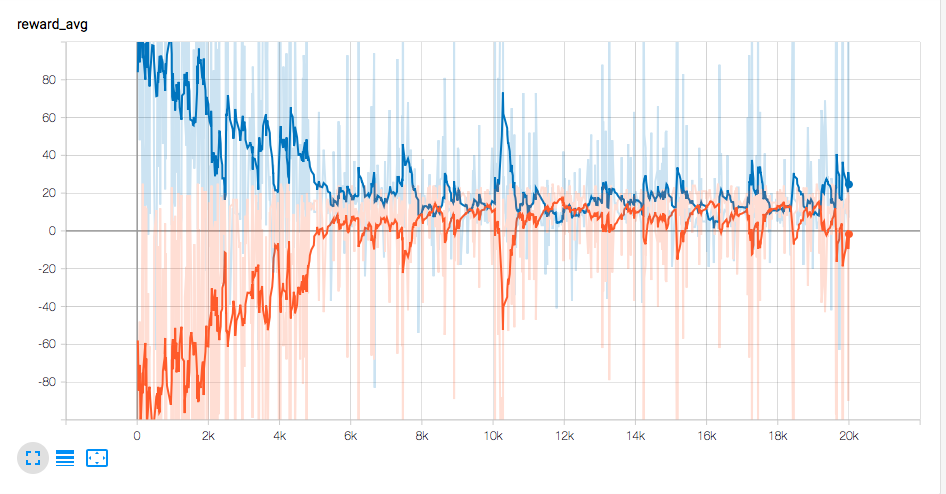
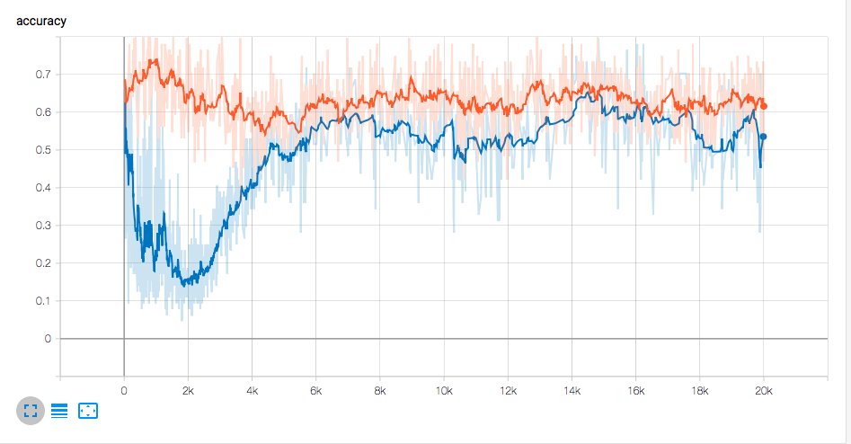

# Multi Agent Deep Reinforcement Learning
 - implemented as solution to one of problems of Fanavard Data Minig challanege 
 
Our main goal in this work is to choose a simple game environment so that we can evaluate the performance of multi-agent reinforce- ment learning on it.
For this purpose, we picked the pursuit-evasion problem. We will refer to the two types of agents as thief and police. The police are attempting to catch the thief and the thief is trying to escape.
Since we limit the problem to a discrete state space, the police receive a reward anytime they occupy the same grid cell as a thief. Each of the agents can go to the 8 houses around them or stay in place and do not move.
<figure>
  
  <figcaption>Fig1. - The environment of the game where the blue robot as a police is trying to catch the red robot that we considered as a thief. Each of the agents can go to the 8 houses around them or stay in place and do not move.
.</figcaption>
</figure>

Figure 2 shows the accuracy of the model and Figure 3 shows the average reward of two agents.

<figure>
  
  <figcaption>Fig2. - The accuracy of the model, blue chart is for thief agent and the orange is for police agent .</figcaption>
</figure>

<figure>
  
  <figcaption>Fig3. - The average reward of the model, blue chart is for theif agent and the orange is for police.</figcaption>
</figure>

you can find more about this research here :
ArXiv: http://arxiv.org/abs/0803.0476
